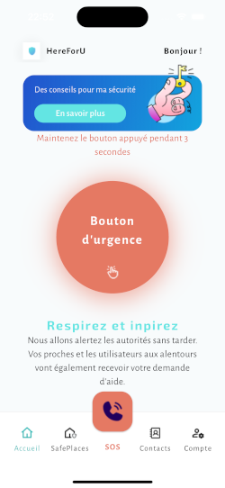
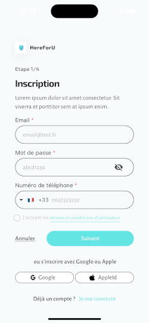
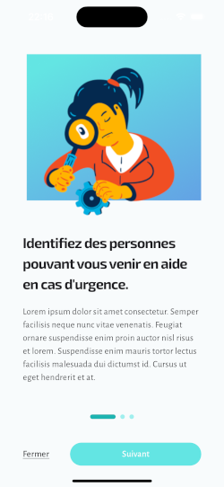

# Here for You

Here for You is a powerful mobile application designed to assist survivors of domestic violence in their journey towards safety and support. Our app provides a safe and confidential platform for individuals experiencing domestic abuse to find secure locations and resources to escape their harmful situations.

<br>

!<br>
<br></br>

## Getting Started
To get a local copy of the project up and running, follow these simple steps.

Prerequisites
* Flutter installed on your machine.
* Dart SDK.
* An editor such as Android Studio or Visual Studio Code.

## Installation

Clone the repository:

## Installation
Clone this repository and import into **Android Studio**
```bash
git clone https://github.com/edsonDeCavalho/flutter-hereForYou.git
```

Navigate to the project directory:

```bash
cd flutter-hereForYou
```
cd flutter-hereForYou

Install the dependencies:

```bash
flutter pub get
```

Ensure you have a connected device or emulator running.

```bash
flutter run
```


## License

This application is released under GNU GPLv3 (see [LICENSE](LICENSE)).
Some of the used libraries are released under different licenses.

    